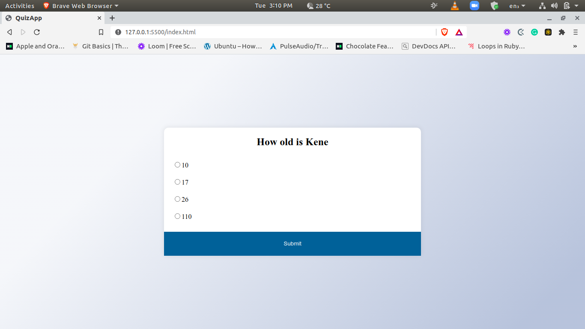

Quiz App

## Description

### This project is a javascript based Quiz App application

Quiz App web app allows users to test their knowledge.


## Library Directory 📙

| Contents                    |
| --------------------------- |

| [Live Demo](#live-demo)     |
| [Screenshot](#screenshot)   |
| [Built With](#built-with-🛠) |
| [Contributing](#contributing🛠) |
| [Authors](#authors)         |
| [License](#license)         |

## Live Demo

[Live demo](./)

 ## Screenshot



## Built With 🛠

```
- HTML/CSS
- Javascript/ES6
```

## Contributing

- Fork the project
- Create your own feature branch `git checkout -b feature`
- Commit your changes `git commit -m 'feature branch`
- Push it `git push -u origin awesome-feature`
- Open a pull request using this branch

## Author

### 👨‍💻 Kene

[](https://github.com/keneogu) <br>
[](https://www.linkedin.com/in/kene-ogu) <br>
[](https://twitter.com/keneogu)


### 🤝 Contributing

Contributions, issues and feature requests are welcome!

Feel free to check the [issues page]().

### Show your support

Give a ⭐️ if you like this project!

### License

